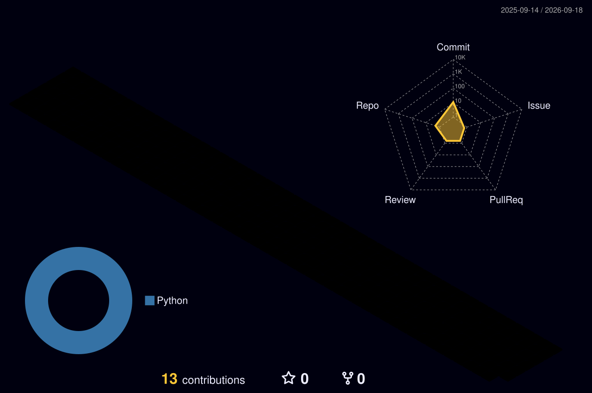

  

 

&nbsp;&nbsp;
&nbsp;&nbsp;

   

  <i>
    I architect intelligent enterprise systems at the intersection of  
    Microsoft Cloud, Power Platform, and Generative AI.   
    Currently building autonomous monitoring engines, agentic workflows,  
    and scalable low-code enterprise architectures that serve thousands.
  </i>

  

  <h3>✦ What I Build ✦</h3>

> **Cloud & Enterprise Architecture**
>  
> Azure · Dynamics 365 · Microsoft 365 · Fabric
>   
> **Power Platform Solutions**
>  
> Power Apps · Power Automate · Power BI · Copilot Studio
>   
> **AI & Automation Systems**
>  
> Autonomous Agents · LangChain · OpenAI · Python
>   
> **DevOps & Infrastructure**
>  
> GitHub Actions · Docker · Kubernetes · Terraform

  

  <h3>✦ How I Work ✦</h3>

  
<b>▸ Guiding Principles</b>

  <blockquote>
    • Ship production-grade, not prototypes 
    • Automate anything that runs twice 
    • Architecture-first, code-second 
    • Measure everything, assume nothing
  </blockquote>

  
<b>▸ Technology Depth</b>

  <blockquote>
    <code>Power Platform : ●●●●●●●●●● Expert</code> 
    <code>Azure Cloud    : ●●●●●●●●●○ Advanced</code> 
    <code>Dynamics 365   : ●●●●●●●●●○ Advanced</code> 
    <code>AI Agents      : ●●●●●●●●○○ Proficient</code> 
    <code>Full Stack     : ●●●●●●●○○○ Skilled</code>
  </blockquote>

   

   

   

<picture>
  <source media="(prefers-color-scheme: dark)" srcset="https://raw.githubusercontent.com/Anmolsarowa/Anmolsarowa/output/github-contribution-grid-snake-dark.svg" />
  <source media="(prefers-color-scheme: light)" srcset="https://raw.githubusercontent.com/Anmolsarowa/Anmolsarowa/output/github-contribution-grid-snake.svg" />
  
</picture>

   

<i>Less noise. More signal. Ship it.</i>

